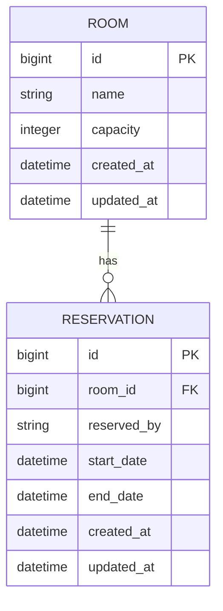
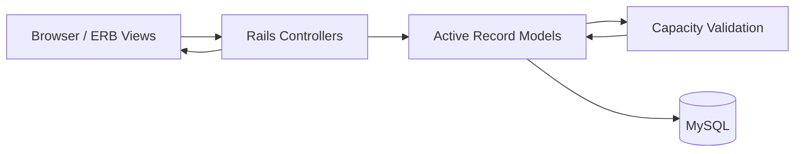

# Dolomit Space

A small **Meeting Room Reservation System** built with Ruby on Rails and MySQL.

The main purpose of the project is not only to provide CRUD operations for rooms and reservations, but to enforce the central business rule:

> A reservation can be saved only if the room capacity is not exceeded at any moment during the requested time interval.

The project intentionally keeps the domain small so that the reservation and capacity logic remains explicit and easy to review.

---

## Tech Stack

- Ruby 4.0
- Ruby on Rails 8.1
- MySQL
- ERB views
- SCSS / Dart Sass
- Minitest
- GitHub Actions

Rails 8.1 satisfies the assignment requirement of Rails 7+.
No frontend framework is required or used for the application UI.

---

## Implemented Scope

### Rooms

- list rooms
- display a room
- create a room
- room name validation
- positive integer capacity validation
- display reservations belonging to the room

### Reservations

- create a reservation
- edit an existing reservation
- update a reservation
- required field validation
- validation that `end_date` is after `start_date`
- room capacity validation
- support for overlapping reservations up to the room capacity

Reservations are displayed directly on the room detail page instead of introducing separate reservation index/show pages. This keeps navigation simple while still exposing the information required by the assignment.

---

# Database Relationship Diagram



`reservations.room_id` is backed by a foreign key and an index.

Required business fields are also protected by database-level `NOT NULL` constraints in addition to Active Record validations.

---

# Main Model Groups

## Room

`Room` represents the resource being reserved.

Its responsibilities are intentionally small:

```text
Room
├── resource identity
├── capacity
└── collection of reservations
```

Main rules:

```ruby
has_many :reservations

validates :name, presence: true
validates :capacity,
          presence: true,
          numericality: {
            only_integer: true,
            greater_than: 0
          }
```

A third `Resource` model would only duplicate the responsibility of `Room`, so I deliberately did not introduce one.

---

## Reservation

`Reservation` represents one booking of a room during a specific time interval.

```text
Reservation
├── room
├── reserved_by
├── start/end time
├── interval validity
└── room capacity business rule
```

It belongs to exactly one room:

```ruby
belongs_to :room
```

The model validates both the structure of the reservation and the business invariant that room capacity must never be exceeded.

---

# Project Architecture

The application follows a deliberately simple Rails flow:



Controllers are kept thin.

Their responsibility is primarily to:

- receive parameters
- create or update records
- render validation errors
- redirect after successful operations

The capacity rule is **not implemented in a controller or view**.
It belongs to `Reservation`, because it is a business rule that must be true regardless of whether a reservation is created or updated.
This also means that the same rule is automatically applied from every place that attempts to save a `Reservation`.

---

# Decisions

## 1. Two domain models instead of adding unnecessary entities

The assignment allows an optional third model such as a user or category.
I intentionally kept the domain to:

```text
Room
Reservation
```

A User model or authentication layer would add unrelated complexity without improving the core capacity problem being evaluated.

For the scope of this task, `reserved_by` is therefore stored directly on the reservation.

---

## 2. `start_date` and `end_date` are `datetime`

I kept the field names from the assignment but chose the `datetime` database type rather than `date`.

The capacity rule depends on both the date **and the time**.

For example:

```text
23.09.2026 10:00
        ↓
23.09.2026 12:00
```

Using only a date would make it impossible to correctly reason about simultaneous reservations inside the same day.

---

## 3. Reservation intervals are treated as half-open intervals

The overlap condition is:

```text
existing.start_date < candidate.end_date
AND
existing.end_date > candidate.start_date
```

Therefore these reservations are allowed:

```text
10:00 ───────── 11:00
                 11:00 ───────── 12:00
```

One reservation ending exactly when another starts does not consume capacity at the same moment.

This avoids an unnecessary gap between consecutive reservations.

---

## 4. Capacity validation belongs to the model

Capacity is a domain invariant of a reservation, not a presentation rule.

For that reason it is implemented as a custom Active Record validation:

```ruby
validate :room_capacity_available
```

This keeps controllers focused on HTTP/application flow and ensures both `create` and `update` go through the same rule.

---

# Capacity Validation Algorithm

A tempting implementation would be:

```ruby
overlapping_reservations.count
```

but this is not sufficient.

Consider a room with capacity `2` and a new reservation:

```text
NEW: 10:00 ───────────────── 14:00
```

while these reservations already exist:

```text
A:   10:00 ── 11:00

B:                     13:00 ── 14:00
```

Both `A` and `B` overlap the **new reservation**, but they do not overlap each other.

At no moment are all three reservations active.

Simply counting records would therefore incorrectly reject a valid reservation.

---

## Event sweep

The validation first fetches only reservations that can intersect the candidate interval:

```ruby
room.reservations.where(
  "start_date < ? AND end_date > ?",
  end_date,
  start_date
)
```

For an update, the reservation being edited is excluded from this query so that it does not conflict with itself.

Every overlapping interval is then converted into two events:

```text
start -> +1
end   -> -1
```

For example:

```text
10:00 +1
11:00 -1
```

The candidate reservation is added to the same event set.

The events are ordered by timestamp and the algorithm keeps a running count of currently active reservations.

If that count becomes greater than `room.capacity`, validation fails.

---

## Boundary ordering

Events are sorted using both the timestamp and the change value.

That intentionally causes:

```text
-1
```

to be processed before:

```text
+1
```

when both events occur at exactly the same time.

Therefore:

```text
10:00 ───── 11:00
             11:00 ───── 12:00
```

uses only one capacity slot at `11:00`, which is consistent with the overlap query and the half-open interval interpretation.

---

# Why the Capacity Algorithm Works

Each potentially overlapping reservation is represented as a `+1` event at its start and a `-1` event at its end, so the running event count is the number of reservations active after every time boundary. By scanning these events chronologically and rejecting the candidate whenever the running count exceeds the room capacity, the validation checks the actual maximum simultaneous occupancy rather than merely counting records that overlap the candidate. During updates, the current reservation is excluded from the existing set, so the same rule works correctly for both create and update operations.

---

# Important Edge Cases

The implementation explicitly handles several cases that can otherwise produce incorrect results.

### Adjacent reservations

```text
10:00–11:00
11:00–12:00
```

Allowed.

They are not treated as simultaneous reservations.

### Reservation inside another reservation

```text
Existing: 10:00 ───────────── 14:00
New:            11:00 ── 12:00
```

Correctly contributes to simultaneous capacity.

### Candidate containing several separate reservations

```text
Existing A: 10:00–11:00

Candidate:  10:00────────14:00

Existing B:             13:00–14:00
```

The algorithm evaluates simultaneous occupancy rather than simply counting `A` and `B`.

### Editing an existing reservation

During an update, the reservation excludes itself from the overlap query.
Otherwise an unchanged reservation could incorrectly consume an additional capacity slot during its own validation.

### Invalid interval

A reservation is rejected when:

```text
end_date <= start_date
```

---

# Seed Data

`db/seeds.rb` is designed as more than placeholder data.

It provides several ready-to-review reservation scenarios so that the core business rule can be evaluated immediately after:

```bash
bin/rails db:setup
```

The current seed set contains five rooms with different capacities and multiple interval relationships.

### Conference Room A

```text
Capacity: 3

Anna     09:00 ───────────────── 12:00
John            10:00 ── 11:00
Maria                 10:30 ── 11:30
```

Between `10:30` and `11:00`, the room is at:

```text
3 / 3
```

Trying to create one more reservation during this period should be rejected.

### Meeting Room B

Demonstrates:

- nested intervals
- reservations touching exactly at interval boundaries
- capacity `2`

### Boardroom C

Contains chained and partially overlapping reservations.

### Overlap Test Room

Contains intentionally varied interval relationships, including:

- identical intervals
- nested intervals
- overlap at the beginning
- overlap at the end
- an interval containing another interval
- exact boundary contact

### Focus Room

Uses capacity `1` and demonstrates that consecutive reservations are allowed when one starts exactly when the previous one ends.

---

# Quick Start

## Requirements

You need:

```text
Ruby
Bundler
MySQL
```

Install project dependencies:

```bash
bundle install
```

---

## Database configuration

The local MySQL password is intentionally **not stored in Git**.

For Git Bash / Linux / macOS:

```bash
export MYSQL_PASSWORD='your_mysql_password'
```

If MySQL runs on a non-default host, `DB_HOST` can also be configured according to the environment.

For PowerShell:

```powershell
$env:MYSQL_PASSWORD="your_mysql_password"
```

Then prepare the database:

```bash
bin/rails db:setup
```

`db:setup` creates the database/schema and loads the provided seed scenarios.

---

## Build styles

The project uses SCSS through Dart Sass.

Build styles once with:

```bash
bin/rails dartsass:build
```

or run the Sass watcher during development:

```bash
bin/rails dartsass:watch
```

---

## Start the application

```bash
bin/rails server
```

Open:

```text
http://localhost:3000
```

---

# Project Structure

```text
app/
├── controllers/
│   ├── rooms_controller.rb
│   └── reservations_controller.rb
│
├── models/
│   ├── room.rb
│   └── reservation.rb
│
├── views/
│   ├── rooms/
│   └── reservations/
│
└── assets/
    └── stylesheets/

db/
├── migrate/
├── schema.rb
└── seeds.rb

config/
├── routes.rb
└── database.yml

test/
├── models/
└── system/
```

The project deliberately follows standard Rails conventions rather than introducing additional service layers for a problem of this size.

---

# Code Quality and CI

The repository contains a GitHub Actions workflow for automated project checks.

The workflow covers:

```text
RuboCop
Brakeman
Bundler Audit
Importmap Audit
Rails tests
System tests
MySQL-backed test environment
```

A basic system smoke test verifies that the rooms page can be rendered.

The current scope does not claim comprehensive automated coverage of the capacity algorithm; adding focused model tests for every overlap scenario would be one of the first follow-up improvements.

---

# Styling

The application uses `.scss` files without a frontend framework.

Styles are split by responsibility rather than placing the entire UI in one file:

```text
application.scss
_variables.scss
_layout.scss
_forms.scss
_rooms.scss
_reservations.scss
```

This keeps styling modular while remaining intentionally lightweight for the scope of the assignment.

---

# What I Would Improve With More Time

## Concurrency safety

The current Active Record validation correctly handles reservations evaluated sequentially.
In a production system, two requests could theoretically read the same available capacity at the same time and both attempt to commit.
I would protect the capacity invariant against this race condition by serializing reservation writes for the relevant room inside a database transaction, for example using an appropriate row-locking strategy, and repeating the capacity check while the lock is held.

---

## Focused model test coverage

I would add explicit automated tests for:

```text
no overlap
partial overlap
full containment
identical intervals
exact boundary contact
capacity exactly reached
capacity exceeded
reservation update
self-exclusion during update
invalid start/end ranges
different rooms remaining independent
```

These cases are already represented conceptually in the seed scenarios, but they should also be protected by automated model tests.

---

## Query and index optimization

For a small assignment dataset, the current overlap query is sufficient.
With a large reservation table, I would profile the query and introduce indexes appropriate to the real access pattern, particularly around:

```text
room_id
start_date
end_date
```

The event algorithm itself operates only on reservations that can intersect the requested period rather than scanning every reservation in the database.

---

## Time zone policy

For a production booking system I would define the application's business timezone explicitly, store timestamps consistently, and make timezone presentation clear to users.

---

## UX

With additional time I would improve:

- availability visualization
- clearer capacity status
- filtering reservations by date
- room-specific reservation creation directly from the room page
- more descriptive validation feedback
These improvements would not change the central capacity rule.

---

# Notes

Rails 8 generates Docker/Kamal-related files by default.
Docker is **not required** to run or evaluate this project and is intentionally not part of the application setup described above.